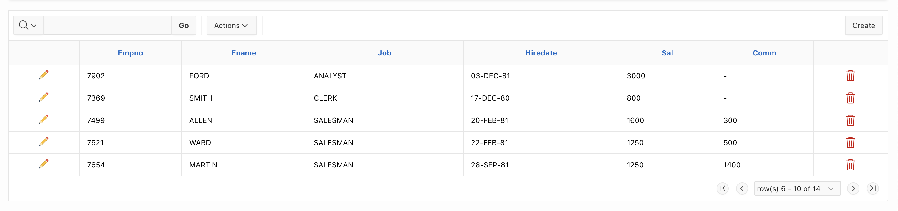

# Enhancing Oracle APEX Interactive Report Pagination

## Overview

Oracle APEX provides Interactive Reports (IR) with default pagination options, but in some cases, the navigation might lack the intuitive controls users expect, such as first/last buttons and a row range selector.

## Features

- Add first and last buttons to quickly navigate to the start and end of the data.
- Introduce a dropdown to allow users to select specific ranges of rows directly.

## Attributes
| Attribute Name       | Description                                | Example         |
|----------------------|--------------------------------------------|-----------------|
| **Buttons behavior** | Disable/hide buttons when page reached     | `DISABLE`       |
| **First page title** | Title on first page button (when eneabled) | `First Page`    |
| **First page icon**  | Icon for first page button                 | `fa-page-first` |
| **Last page title**  | Title on last page button (when enabled)   | `Last Page`     |
| **Last page icon**   | Icon for last page button                  | `fa-page-last`  |

## Usage Examples

### Dynamic Action on Framework Events (After Refresh)
1. **Create a Dynamic Action** in your page.
2. **Execution**
    - **Event Scope**: `Static`
    - **Type**: `Immediate`
3. **When**
    - **Event**: `After Refresh`
    - **Selection Type**: `Region`
    - **Region**: `Employees`
3. **Action**: `SMART4Solutions IR Pagination [Plug-in]`
    - **Buttons**:
        - **Buttons behavior**: `Disable buttons when page reached`
        - **First page title**: `First Page`
        - **First page icon**: `fa-page-first`
        - **Last page title**: `Last Page`
        - **Last page icon**: `fa-page-last`

## License

This project is licensed under the MIT License. See the LICENSE file for details.

## Contribution

Feel free to contribute to the project by opening issues or submitting pull requests.
